# FPV Parametric Library

A collection of **fully parametric OpenSCAD models** for FPV (First Person View) vehicle mounts and accessories. This library is designed to allow users to generate custom 3D printable parts (STL) perfectly tailored to their specific hardware, frame dimensions, and printing preferences.

## 📂 Repository Structure

The library is organized by vehicle type:

- **`Mounts/Fixed-Wing/`**: Aerodynamic mounts designed for wings and fuselages.
    - Action Camera Mounts (e.g., GoPro 3-tab style)
    - Antenna Mounts (ELRS, VTX)
    - GPS Modules
- **`Mounts/Multi-rotor/`**: Standoff-mounted and frame-specific accessories for quadcopters.
    - Antenna Mounts (SMA, ELRS T-antenna)
    - GPS Holders
    - Buzzer Mounts

## 🚀 Usage

These files are designed to be used with [OpenSCAD](https://openscad.org/).

1. **Download & Install OpenSCAD**: Get the latest version from the official website.
2. **Open a Model**: Double-click any `.scad` file to open it.
3. **Customize Parameters**:
    - Use the **Customizer** pane (Window > Customizer) to easily adjust settings like:
        - `base_w`, `base_l` (Dimensions)
        - `standoff_dia` (Hardware fit)
        - `wall_thickness` (Print strength vs weight)
        - `tilt_angle` (Camera/Antenna angle)
    - Alternatively, edit the variables at the top of the code directly.
4. **Render & Export**:
    - Press **F6** to Render the final geometry.
    - Press **F7** (or File > Export > Export as STL) to save your printable file.

## ✨ Features

- **Parametric Design**: Almost every dimension includes a variable, allowing adjustment for different hardware standards or manufacturing tolerances.
- **Printer Optimized**: Many parts are designed with 3D printing in mind (e.g., specific wall thicknesses for nozzle sizes, no-support designs where possible).
- **Material Recommendations**:
    - **TPU (Flexible)**: Recommended for bumpers, antenna mounts, and action cam mounts to absorb impact.
    - **PETG/PLA+ (Rigid)**: Suitable for GPS trays or structural components.

## 📝 Examples

- **Fixed Wing Action Cam Mount**: Modify `base_w` and `base_l` to match the curvature and size of your specific wing.
- **ELRS Antenna Mount**: Adjust `standoff_dia` to friction-fit perfectly onto your drone's standoffs (e.g., 5mm or 6mm knurled standoffs).

## 🤝 Contributing

Feel free to submit Pull Requests with new parametric designs or improvements to existing ones. Please ensure your code is well-commented and variables are clearly defined at the top of the file.

## 🖼️ Gallery

<!-- GALLERY_START -->
| | | |
|:---:|:---:|:---:|
| 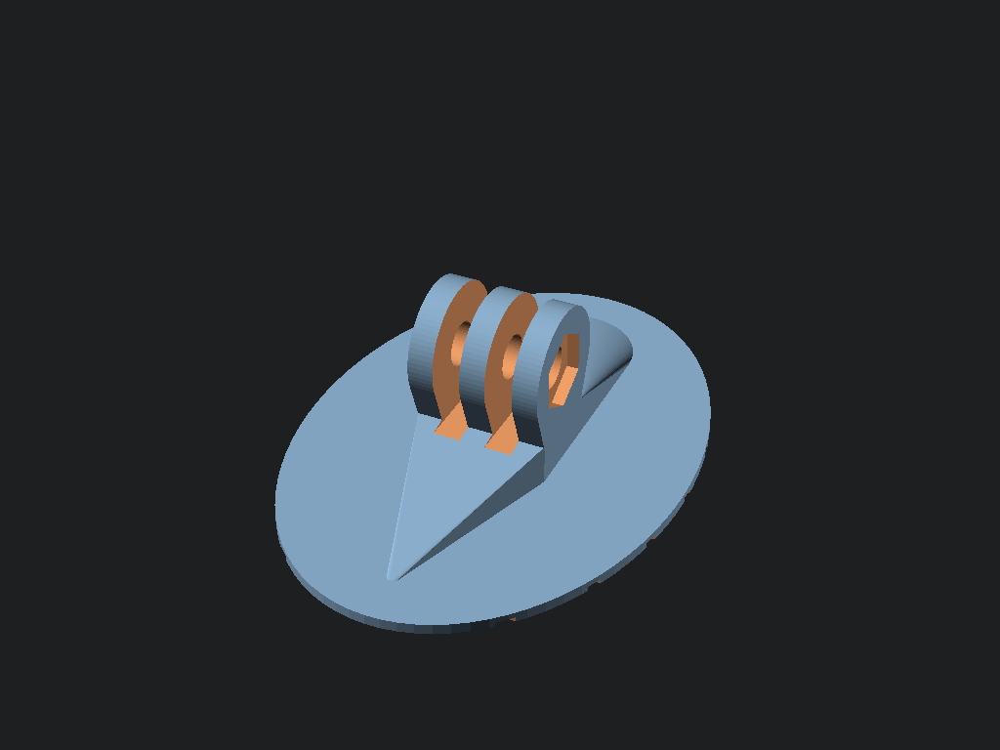 **ActionCam Mount Fixed Wing** | 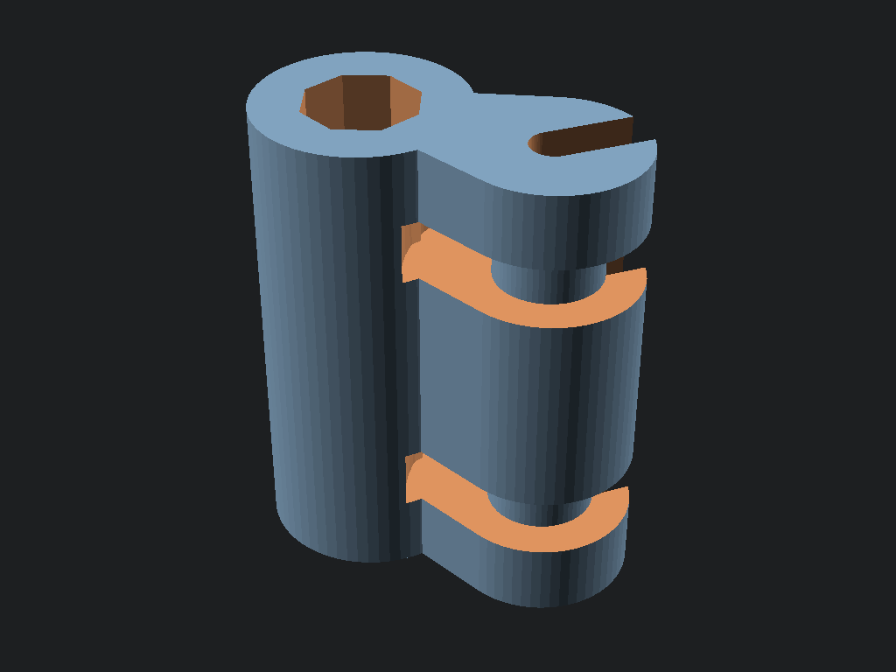 **ELRS Antenna Standoff** | 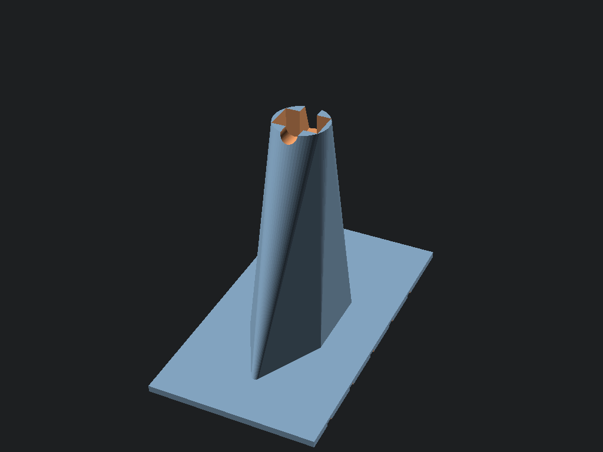 **ELRS Fixed Wing Vertical** |
| 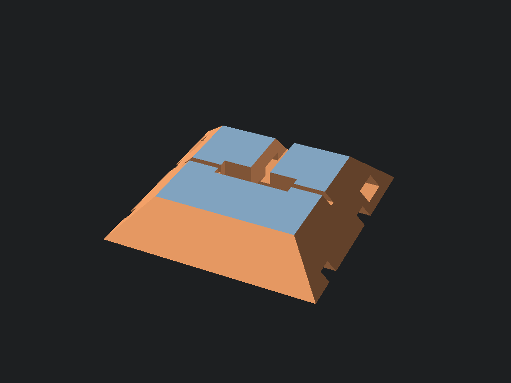 **ELRS Fixed Wing** | 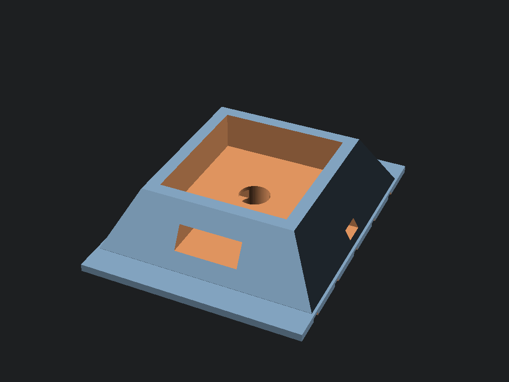 **Fixed Wing GPS** | 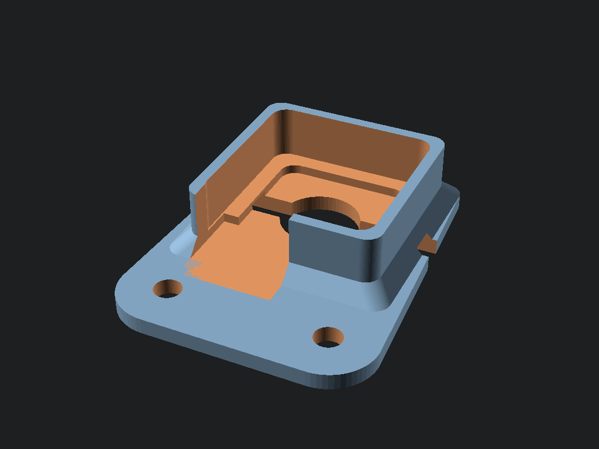 **Flat mount GPS** |
| 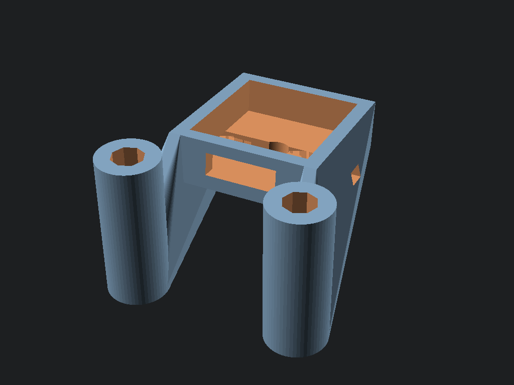 **GPS standoff mount** | 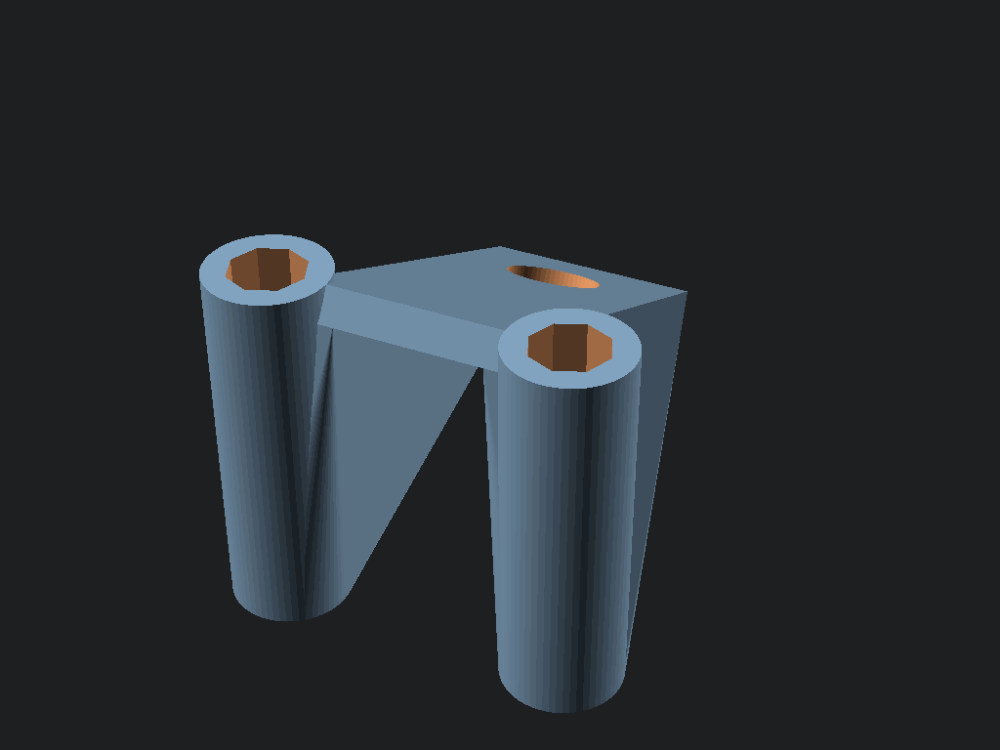 **SMA Standoff Mount** | 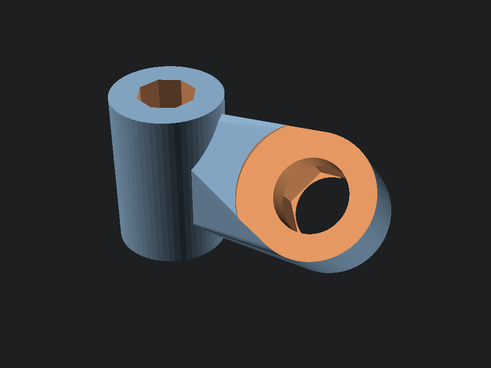 **SMA single standoff** |
| 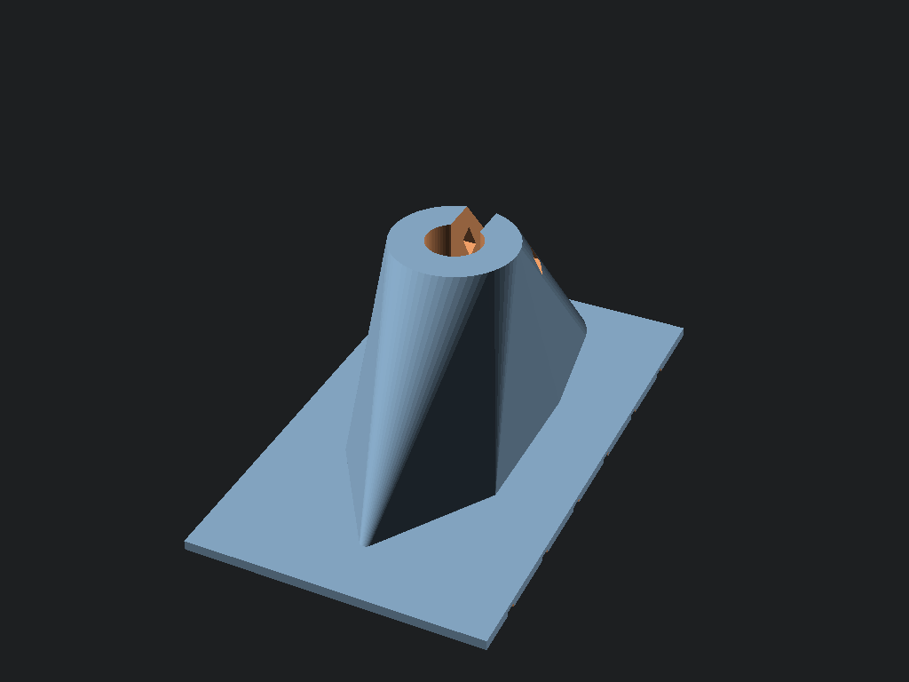 **VTX Antenna Tower Fixed Wing** | 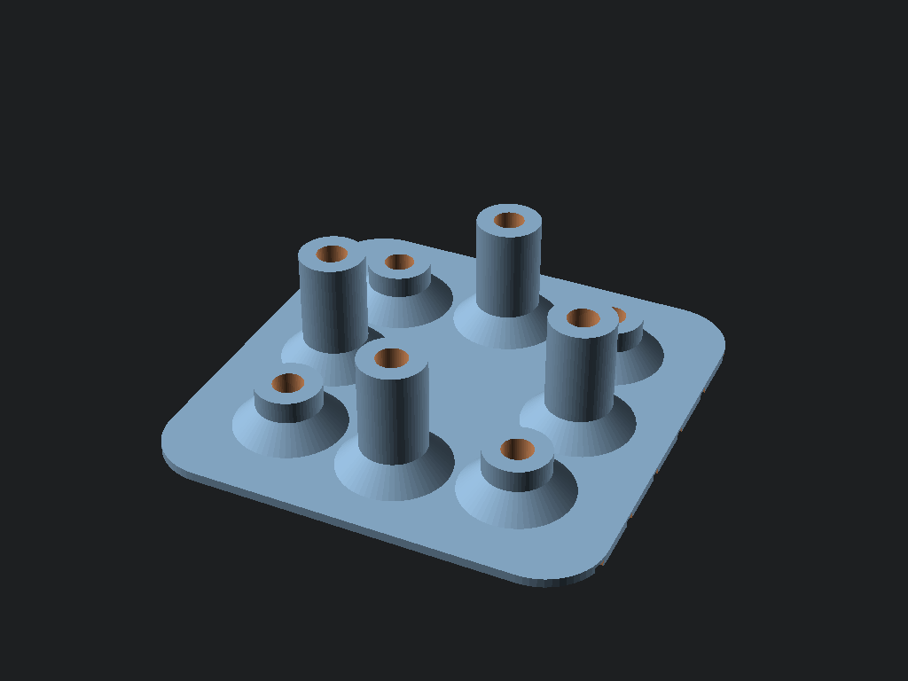 **VTX Mount OptionalFan** | 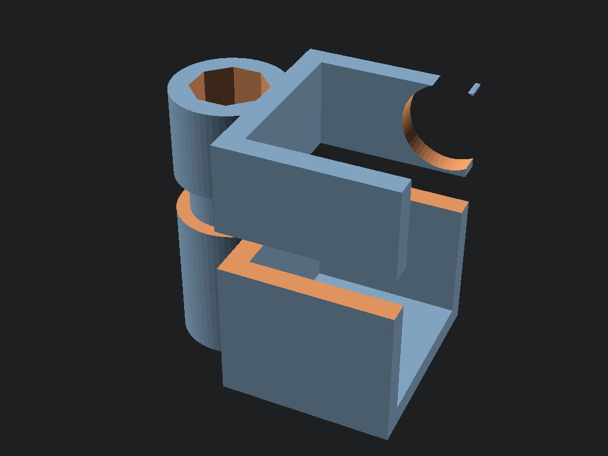 **Vifly Buzzer Standoff** |
<!-- GALLERY_END -->
